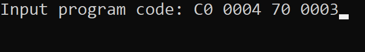
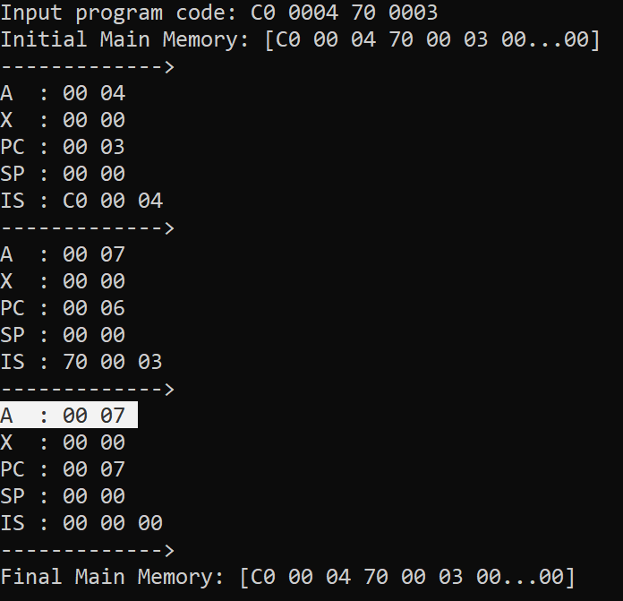

# VirtualComputer
 
This is a program that simulates a CPU and main memory. As input, it receives a program that is written in machine code (only hexadecimal). It will then run that program. After each instruction execution, the registers of the CPU will be printed to the console.
 
## Example Program: Adding Two Numbers
 
The following example program adds two numbers. It has three instructions.

**The Program Represented In:**

Assembly code:<br>
```
LOAD 4;     # loads 4 to register
ADD  3;     # adds 3 to value in register (4)
STOP  ;     # program stop instruction
```

Machine code (*hexadecimal*):<br>
```
C0 0004
70 0003
00 0000
```

Machine code (*binary*):<br>
```
11000000 0000000000000100
01110000 0000000000000011
00000000 0000000000000000
```

## Executing/Running The Example Program




